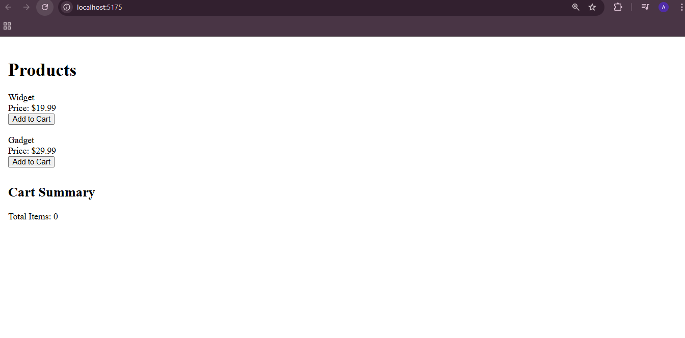
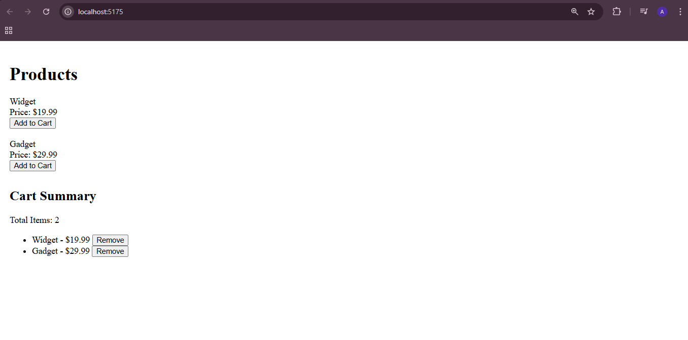

 ## React JS Exercise 16
  
  ***
  
  ## Developer Name: Eng Abdirahman Ai
  
  ***
  
  ## Group A
  
  ***
  
  [GitHub Link](https://github.com/engai2025/React-Exercise-16)
  
  ***
  
  ## Code
  
  ### App.jsx
  
  ```jsx
  import React from "react";
import { CartProvider } from "./CartContext";
import ProductList from "./ProductList";
import CartSummary from "./CartSummary";

function App() {
  return (
    <CartProvider>
      <div style={{ padding: "12px" }}>
        <h1>Products</h1>
        <ProductList />

        <CartSummary />
      </div>
    </CartProvider>
  );
}

export default App;


  ```
  
  ### Product.js
  
  ```jsx
  
const products = [
  { id: 1, name: "Widget", price: 19.99 },
  { id: 2, name: "Gadget", price: 29.99 },
];

export default products;


  ```
### ProductList.jsx
  
  ```jsx
import React, { useContext } from "react";
import { CartContext } from "./CartContext";
import products from "./products";

const ProductList = () => {
  const { addItem } = useContext(CartContext);

  return (
    <div>
      {products.map((p) => (
        <div key={p.id} style={{ marginBottom: "18px" }}>
          <div>{p.name}</div>
          <div>Price: ${p.price.toFixed(2)}</div>
          <button onClick={() => addItem(p)}>Add to Cart</button>
        </div>
      ))}
    </div>
  );
};

export default ProductList;

```

### CartSummary.jsx
  
  ```jsx
  
 import React, { useContext } from "react";
import { CartContext } from "./CartContext";

const CartSummary = () => {
  const { cartItems, removeItem, totalItems  } = useContext(CartContext);

  return (
    <div style={{ marginTop: "30px" }}>
      <h2>Cart Summary</h2>
      <div>Total Items: {totalItems}</div>
      <ul>
        {cartItems.map((item) => (
          <li key={item.id}>
            {item.name} - ${item.price.toFixed(2)}{" "}
            <button onClick={() => removeItem(item.id)}>Remove</button>
          </li>
        ))}
      </ul>

     
 
    </div>
  );
};

export default CartSummary;

  
```  
### CartContext.jsx
  
  ```jsx

import React, { createContext, useState } from "react";

export const CartContext = createContext();

export const CartProvider = ({ children }) => {
  const [cartItems, setCartItems] = useState([]);

  const addItem = (product) => {
 
    setCartItems((prev) => [...prev, product]);
  };

  const removeItem = (id) => {
    setCartItems((prev) => prev.filter((item) => item.id !== id));
  };

  const clearCart = () => setCartItems([]);

  const totalItems = cartItems.length;
  const totalPrice = cartItems.reduce((sum, item) => sum + item.price, 0);

  return (
    <CartContext.Provider
      value={{ cartItems, addItem, removeItem, clearCart, totalItems, totalPrice }}
    >
      {children}
    </CartContext.Provider>
  );
};


```  
  ## Output 1
  
  ***
 
  
  
   
  ## Output 2 Result
  
  ***
 
  

   
  ***


 


 
 
  
  ***
  
  ## Programming Language Used
  
  ***
  
  | Programming Language | Framework | Database |
  |:--------------------|:----------|:---------|
  | React JS            | 0         | 0        |
  
  ***
  
  ## Task
  
  - [x] Done
  
  